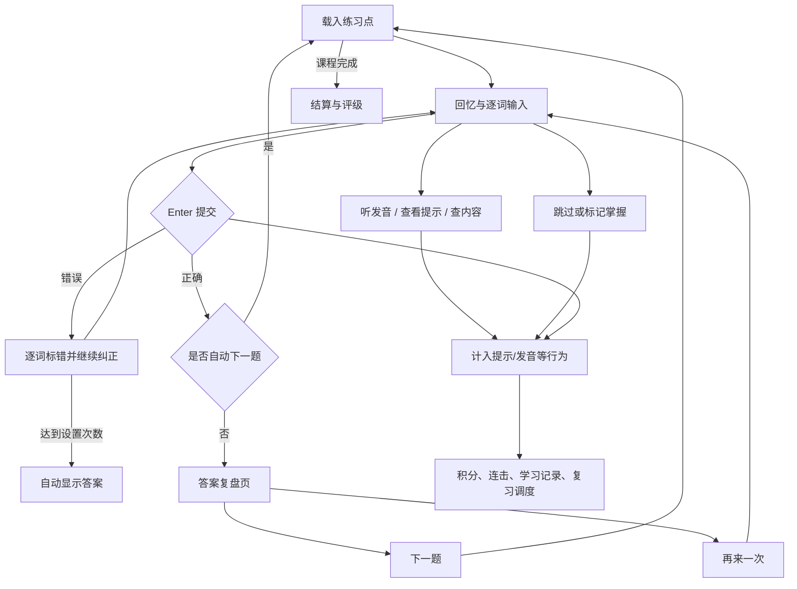

# Julebu（句乐部）练习区域功能分析

> 结论：句乐部的练习区不是一个普通答题框，而是一套围绕“回忆—输入—纠错—答案复盘—评分—间隔复习”构建的状态机。它的核心价值来自稳定的单屏练习、逐词输入与反馈，以及每个练习动作都会影响后续评分和复习调度。

- 调研日期：2026-07-22
- 调研范围：课程、复习本和生词本共用的练习区域，以及其答案页、结算页和直接影响练习行为的设置；不包含商城、社交、编辑端和付费体系。
- 主要证据：句乐部官方[快速上手](https://julebu.co/docs/quick-start/)、[学习模式](https://julebu.co/docs/guide-learning-modes/)、[偏好设置](https://julebu.co/docs/guide-settings)、[连击与评级](https://julebu.co/docs/guide-combo)、[复习系统](https://julebu.co/docs/guide-review)、[生词本](https://julebu.co/docs/guide-vocabulary-book)、[笔记本](https://julebu.co/docs/guide-notes/)、[AI 助手](https://julebu.co/docs/guide-ai-assistant)、[更新日志](https://julebu.co/releases)和官方产品截图。
- 限制：实际练习页需要登录，公开试玩也会跳到登录页，因此无法对当前登录态页面的 DOM、焦点顺序和屏幕阅读器行为做完整验证。官方帮助图、营销图和更新日志来自不同版本，本文会明确指出冲突，不把旧功能与新功能误认为同时存在。
- 历史实现：官方 [About](https://julebu.ai/about/) 确认句乐部源自开源项目 [Earthworm](https://github.com/cuixueshe/earthworm)。该仓库只用于核对产品血缘和早期交互，不代表 2026 年现网实现；其主分支停留在 2024 年，练习模式和功能明显少于当前产品。

## 一、页面结构

官方快速上手截图展示了一块稳定的全屏练习台，课程切换、题目、输入、反馈和快捷操作不会跳到不同页面。[旧版完整练习截图](https://assets.julebu.co/docs-site/G8ejbhzVDo32UYxEDIQcnMtxnDd.png)、[工具栏标注图](https://assets.julebu.co/docs-site/XKKbb3TW3ooFDJxtb5acf4QOn7b.png)和[新版深色练习截图](https://julebu.ai/images/landing/hero-game-preview.webp)可以互相补全其区域组成。

| 区域 | 功能 | 行为 |
| --- | --- | --- |
| 顶部课程栏 | 菜单/离开、当前课次、当前题/总题数、整体进度条 | 持续告诉学习者“在哪里、还剩多少” |
| 顶部数据 | 当前积分、练习时长 | 分数可在设置中隐藏；时长用于结算和成长记录 |
| 顶部工具栏 | 可选视频讲解、设置、查看答案、本课内容、句子树、切换练习模式、乱序、暂停、重置课程进度、报告错误、全屏 | 都留在练习上下文内，减少离场成本；重置属于高影响操作 |
| 中央题面 | 中文提示、可选配图、逐词输入轨道 | 中译英时以中文触发英文回忆；听写等模式会替换提示来源 |
| 输入轨道 | 每个目标词独立占位、当前词焦点、已填词和空词状态 | 没有大段文本框；空格推进到下一词，错误可回到指定词修改 |
| 底部操作条 | 发音、掌握、生词、提交/下一题、显示答案/再来一次 | 按钮与键盘快捷键并存，标签会随答题状态改变 |
| 左右翻页 | 上一题、跳过/下一题 | 与 `Shift+←`、`Shift+→` 对应；跳过会影响连击与复习信号 |
| 右下角助手 | 早期是 AI 助手按钮，当前版本替换为桌面宠物助手 | 入口可打开上下文 AI；宠物也承担正确/错误情绪反馈和主动求助 |

当前营销截图的顶部还出现一个圆形播放图标，但公开文档没有给它命名，因此不在已确认工具清单中。

## 二、核心答题状态机

核心不是“对/错”两态，而是至少包含：输入中、提交错误、继续纠正、正确答案页、重试、跳过、暂停、结算。`Enter` 和 `Ctrl+;` 都是状态相关命令：输入时分别用于提交和显隐答案；公开答案页截图中分别变成“下一题”和“再来一次”。[快速上手](https://julebu.co/docs/quick-start/)确认输入、纠错和提交流程，[新版答案态截图](https://julebu.ai/images/landing/combo-system.webp)展示了操作条的状态变化。

## 三、输入与判题功能

需要区分“视觉上直接输入”和“技术上没有输入控件”。历史 Earthworm 的[逐词输入源码](https://github.com/cuixueshe/earthworm/blob/main/apps/client/components/main/QuestionInput/QuestionInput.vue)使用透明原生 `<input>` 捕获键盘，再把字符渲染进可见词槽；这能证明早期交互采用了“隐藏捕获层 + 可视词轨道”，但不能据此断言当前句乐部仍使用相同 DOM 结构。

### 1. 逐词输入

- 目标句被拆成单词、短语、语块、组合语块或完整句子等练习点；初级难度覆盖更多细粒度内容，中级省略单词，高级只练完整句子。[偏好设置](https://julebu.co/docs/guide-settings)
- 输入轨道可按目标单词长度显示、固定等宽，或只显示一条横线。长度本身是一种提示，最新“学习路线 v2”会逐关减弱长度、声音和释义提示。[v1.17.0 更新](https://julebu.co/releases/2026-06-18)
- 空格推进到下一词；鼠标可点击跳回错误词；听写时可以先跳过不会的词，左右方向键可在词槽间移动。中文、日文、韩文输入法组合状态下的空格不会被误判为提交。[更新日志](https://julebu.co/releases)
- 当前版本对带重音字母做宽容匹配，例如普通字母也可判定 `café`、`naïve` 正确；是否忽略大小写由用户设置。[v1.17.0 更新](https://julebu.co/releases/2026-06-18)
- “忽略人名”开启时会自动跳过人名，不要求输入；关闭后才需手打。[学习常见问题](https://julebu.co/docs/faq-learning/)

### 2. 提示与答案

- `Ctrl+;` 显示/隐藏完整答案；`Ctrl+Shift+;` 只查看当前单词答案，二者均可在设置中改键。[偏好设置](https://julebu.co/docs/guide-settings)、[v1.4.1 更新](https://julebu.co/releases/2025-10-30)
- 可以设置答错 1–5 次后自动显示答案，也可以完全关闭自动显示。
- 答案提示有悬浮和内联两种布局；内联更适合手机窄屏。[偏好设置](https://julebu.co/docs/guide-settings)
- 答对后可以自动进入下一题，也可以停留在答案页。开启自动下一题会跳过答案页，从而看不到逐词播放和笔记入口。[学习常见问题](https://julebu.co/docs/faq-learning/)
- 错误不是只给一个总分；公开更新日志明确存在“单词级纠错箭头”，错误后可继续修改并再次提交。[v1.14.0 更新](https://julebu.co/releases/2026-03-24)

## 四、答案复盘页

答案页承担的不是“告诉你正确答案”这么简单，而是一次结构化讲解。官方[新版练习截图](https://julebu.ai/images/landing/hero-game-preview.webp)显示完整句子按句子成分着色，并同时展示音标、词性、词义和中文翻译。

| 功能 | 具体行为 |
| --- | --- |
| 完整答案 | 展示英文目标句及中文翻译 |
| 句子结构 | 主语、谓语等成分分组着色；悬停可看成分名称和解释；仅对已做结构分析的课程有效 |
| 词性与词义 | 每词可显示音标、词性标签/彩色下划线、中文释义；词性标签语言和颜色可配置 |
| 点击查词 | 点击任意单词打开释义卡，查看多词性释义、词形变化，并可播放发音 |
| 生词收藏 | 单词可就地加入/移出生词本；拖选连续词可把整个短语加入生词本，并附例句、用法和近义表达 |
| 逐词播放 | 答案页“小乌龟”逐词慢速朗读；快捷键为 `Cmd/Ctrl+Shift+'`，[v1.1.0 更新](https://julebu.co/releases/2025-09-09) |
| 笔记 | 答案页为当前句子创建、编辑、删除私密笔记；AI 回答可一键保存为笔记；`Cmd/Ctrl+J` 打开/关闭 |
| AI 辅导 | 自动带入当前英文、中文、音标和完整句子；可问语法、词义、翻译、记忆法、例句和近义表达 |
| 学习决策 | 下一题、再来一次、标记掌握、加生词；这些动作会进入评分和复习调度 |

拖选短语时，非选中词会变淡，单词悬停和语法提示暂时禁用，避免多个弹层互相抢交互。[v1.15.0 更新内容](https://julebu.co/releases)

练习区的“报告错误”会先暂停会话，并带入当前中英文内容。用户可多选音频问题（听不清/发音不准）、拼写问题（单词/标点）和翻译问题（词性/含义），再补充描述；关闭面板后恢复练习。重置本课进度则会二次确认，避免误清进度。该细节来自调研当日的[公开现网前端资产](https://julebu.co/_nuxt/DboOefSB.js)，资源哈希未来可能变化。

## 五、快捷键

| 默认快捷键 | 状态/功能 |
| --- | --- |
| `Enter` | 输入态提交；答案态进入下一题；当前听写版本也要求手动确认 |
| `Ctrl+'` | 播放完整发音 |
| `Cmd/Ctrl+Shift+'` | 答案页逐词慢速播放 |
| `Ctrl+;` | 输入态显隐完整答案；官方答案态截图中为再来一次 |
| `Ctrl+Shift+;` | 查看当前单词答案 |
| `Ctrl+M` | 标记当前内容为掌握，之后不再进入课程练习 |
| `Ctrl+N` | 把当前练习点加入生词本 |
| `Cmd/Ctrl+Z` | 立即撤销误标掌握 |
| `Shift+→` | 跳过当前题 |
| `Shift+←` | 返回上一题 |
| `Ctrl+P` | 暂停/继续 |
| `Ctrl+1` | 查看本课学习内容 |
| `Ctrl+2` | 显示/隐藏句子树 |
| `Cmd/Ctrl+/` | 打开/关闭 AI 助手 |
| `Cmd/Ctrl+,` | 打开设置 |
| `Cmd/Ctrl+K` | 打开命令面板并搜索页面/功能 |
| `Cmd/Ctrl+J` | 打开/关闭当前句子笔记 |
| `Space` | 口语模式开始/停止识别；视频观看模式播放/暂停 |
| `Shift+Space` | 口语模式播放自己的录音 |
| `←` / `→` / `F` | 视频观看模式上一句、下一句、全屏 |

官方设置文档称默认快捷键均可自定义。不同模式复用同一按键时，由当前模式和答题状态解释命令。[偏好设置](https://julebu.co/docs/guide-settings)

## 六、游戏反馈与结算

### 1. Perfect、Great 与连击

- `Perfect`：一次输入正确、没有删改、没有看提示；基础分最高。
- `Great`：最终正确，但中途修改过；仍保持连击。
- 答错、看提示或跳过会中断连击。
- 连续 3 次开始出现中央动画；连击加成为：3 次 +10%、5 次 +20%、7 次 +30%、10 次 +50%、15 次 +80%、20 次及以上翻倍。
- 连击和评级只明确适用于中译英、听写两种打字模式。[连击与评级](https://julebu.co/docs/guide-combo)

练习区可播放字符打字音、答对/答错提示音和连击音效。打字音有鼓、气泡、打字机、剑、两种 Cherry 机械键盘等选择，打字音和答题音可分别调音量。游戏总开关、连击动画、连击音效和积分显示都可单独关闭。[偏好设置](https://julebu.co/docs/guide-settings)、[v1.4.1 更新](https://julebu.co/releases/2025-10-30)

### 2. 桌面宠物助手

v1.16.0 后，右下角 AI 圆形入口被可拖动宠物取代：连续答对 3/5/10 题触发挥手、跳跃、奔跑，答错时显示沮丧；连续答错达到阈值会主动询问是否需要帮助并打开 AI。宠物可拖动、右键更换、关闭或调整求助阈值；系统启用“减少动画”时会安静下来。[v1.16.0 更新内容](https://julebu.co/releases)

### 3. 结算页

官方[结算截图](https://julebu.ai/images/landing/combo-system-2.webp)显示：总分/评级、Perfect/Great/跳过数量、练习时长、答题数、最大连击，以及一次命中率、正确率、查看答案、重听次数和平均用时等分析指标；还可回首页、回课程列表、进入学习分析、上一课、再来一次、下一课或分享成绩。

帮助文档仍使用 `C → B → A → S → SS → SSS` 评级，而 v1.16.0 更新又出现 “A+ 高光时刻”分享卡。公开资料没有说明二者是不同场景还是评级改名，因此不能假设当前只有其中一种。

## 七、练习模式

模式切换位于练习页右上角，切换时自动保存当前进度。[学习模式](https://julebu.co/docs/guide-learning-modes/)

| 模式 | 练习区如何变化 |
| --- | --- |
| 中译英 | 显示中文，逐词输入英文；训练拼写、词汇和句型 |
| 听写 | 播放英文，逐词输入听到的内容；当前版本完成后按 `Enter` 手动确认 |
| 听力 | 盲听 → 慢听 → 字幕三阶段；每阶段可开关并配置次数、语速、等待时间、循环、自动下一句和智能间隔 |
| 口语测评 | 显示英文、中文或完全盲读；录音后给 0–100 分和发音纠错，可回放错误录音 |
| 视频观看 | 视频逐句暂停；支持进度条句子标记、变速、音量、字幕/翻译/音标/词性/词义开关、点词查义、每句复读、句子列表、断点续看和全屏 |
| 阅读 | 调研当日的[公开现网前端资产](https://julebu.co/_nuxt/DboOefSB.js)中已出现全文/单句视图、当前句聚焦、朗读、重复/间隔/自动下一句、查词/短语选择、语言注解、排版主题和上下文 AI；帮助文档尚未完整介绍，因此属于“现网可见、文档覆盖不足” |

文字、音频、视频、音乐是课程媒介类型，不等于练习模式；同一练习区会按媒介加载配图、原始音频、视频或歌词。[学习模式](https://julebu.co/docs/guide-learning-modes/)

## 八、个性化设置

| 类别 | 设置项 |
| --- | --- |
| 发音 | 有道、浏览器、高级和会员发音人；题目出现/答案显示时自动朗读 |
| 播放 | 0.5×–2× 速度、播放次数、播放间隔；常用项已外显到练习页快捷设置 |
| 判题 | 自动下一题、忽略大小写、答错几次显示答案 |
| 输入 | 按词长、固定等宽、单横线；悬浮/内联答案 |
| 图片 | 显隐、左/中/右位置、小/中/大尺寸 |
| 难度 | 初级、中级、高级，以及按句子/语块/组合语块/短语单词自由组合的自定义难度 |
| 句子 | 当前句进度、句子结构、单词翻译、忽略人名、词性显示方式/语言/颜色 |
| 游戏 | 总开关、连击动画、连击音效、积分显示、宠物助手及主动求助阈值 |
| 外观 | 浅色/深色/跟随系统、暖色/绿色护眼背景、系统/Fredoka 字体、题目和音标字号 |
| 快捷键 | 绝大多数练习命令可以重新绑定，避免浏览器或系统冲突 |

设置会保存并跨设备同步；这一点依赖账号和云端，不是练习逻辑本身。[偏好设置](https://julebu.co/docs/guide-settings)

## 九、练习动作背后的学习规则

练习区里看似普通的按钮，实际都在改变学习状态：

- 所有练过的内容都会自动进入复习本，不论本次答对还是答错。
- 一次答对、无修改、无提示会延长复习间隔；修改后答对的间隔较短；首次答错、使用提示、跳过或直接看答案会更快再次出现。
- 中译英、听写、口语等能力分开排期；同一内容可能在写作维度已熟练、听力维度仍需复习。
- 反复答对的内容会“毕业”并停止推荐；后来再错会“复活”。
- `Ctrl+M` 把内容移入掌握列表并从课程练习移除；`Ctrl+N` 把内容连同上下文放入生词本。
- 生词本练习会保留原句上下文，只挖空被收藏的单词；短语或整句则作为完整练习点处理。

这些规则由官方[复习与巩固](https://julebu.co/docs/guide-review)和[生词本](https://julebu.co/docs/guide-vocabulary-book)明确说明。也就是说，评分、连击和 SRS 共用同一组“是否一次答对、是否修改、是否看提示、是否跳过”的行为信号。

## 十、移动端与可访问性边界

- 移动端把顶部工具折叠进更多菜单，主按钮会随状态变成“提交 / 下一题 / 完成”，答案、重试和次要动作进入附加操作层；输入槽、字幕和视频控制也有单独的窄屏布局。
- 可以确认的可访问性基础包括大量键盘路径、部分按钮的 `aria-label`/工具提示、少量仅供读屏器的标题说明，以及宠物助手遵从系统 `prefers-reduced-motion`。
- 公开页面不足以确认主输入的完整可读标签、词级错误是否通过 live region 播报、答题后焦点是否可靠恢复，也不足以证明所有动画和模式都支持读屏。因此更准确的结论是“有局部基础，但仍需登录态键盘与屏幕阅读器审计”。

## 十一、对 UtterLoop 的启示

UtterLoop 已在 2026-07-23 对齐核心练习契约：稳定单屏、无可见 textarea 的直接输入、逐词轨道、错误后原地修正、发音、Answer Reveal、Master、Vocabulary、状态相关的 `Enter`、上一题/跳过/暂停、本次会话分数/Combo/计时/结算、本地复习证据、按键触感和无障碍替代按钮。对应实现集中在 `src/presentation/components/PracticeWorkbench.tsx`。

核心快捷键现已对齐；保留的产品差异是：

| 动作 | Julebu | UtterLoop 当前契约 |
| --- | --- | --- |
| `Ctrl+/` | AI 助手 | 为未来可选导师保留，当前不绑定 |
| `Ctrl+N` | 加入生词本 | 保存/移除 Vocabulary |
| `Ctrl+;` | 输入态显隐答案，答案态可重试 | 相同 |
| `Enter` | 提交/下一题 | 提交、继续纠错或下一题 |
| 音频 | 多发音源、播放配置、逐词播放 | 浏览器本地语音合成 |

最值得继续借鉴的不是功能数量，而是四个原则：

1. **状态不换场**：输入、错误、复盘、下一题都留在同一稳定练习面板。
2. **提示逐步撤除**：长度、声音、释义都是可控制的脚手架，熟练后逐渐消失。
3. **答案页也是学习页**：正确后提供结构、词义、音频和重试，而不是只闪一个“正确”。
4. **动作有长期后果**：提示、错误、跳过、掌握、新词都进入统一复习模型。

按 UtterLoop 的本地优先 MVP 边界，AI 助手、桌面宠物、多模式、云端设置同步和社交激励都不需要为了“像 Julebu”而加入。若继续扩展，优先级应是：完善答案复盘 → 逐词导航与当前词提示 → 少量本地练习设置；只有用户确实需要时，再考虑词典、笔记或更多练习模式。

## 十二、公开资料中的版本冲突

- 快速上手截图是较早的白色界面；官网营销图是新版深色界面，工具位置和答案态操作条已有变化。
- 旧设置截图仍出现“错题本”，但 v1.15.0 已宣布错题本正式下架，由复习系统覆盖。
- 帮助文档写 SSS 评级，v1.16.0 更新写 A+ 高光分享卡，关系未说明。
- 早期答案页使用圆形 AI 按钮；v1.16.0 后入口由桌面宠物接管。
- 帮助文档把命令面板写作 `Cmd/Ctrl+K`，调研当日公开现网资产的默认值则出现 `Cmd/Ctrl+Shift+P`；应以用户当前快捷键设置为准。
- 官方文档页显示“最后更新于 2025年6月1日”，但正文包含 2026 年才发布的功能，页面日期元数据不可靠。
- 登录态页面未公开，无法确认当前所有按钮在桌面端、移动端、不同课程类型和会员状态下是否同时可见。
- Earthworm 开源代码是 2024 年及以前的历史实现，不能用来证明当前生产版仍沿用透明输入框、组件结构或仅有两种练习模式。

因此，本文把更新日志中明确宣布的新增/下架视为较新事实，把旧截图主要用于说明布局，不用旧截图证明当前功能仍存在。
